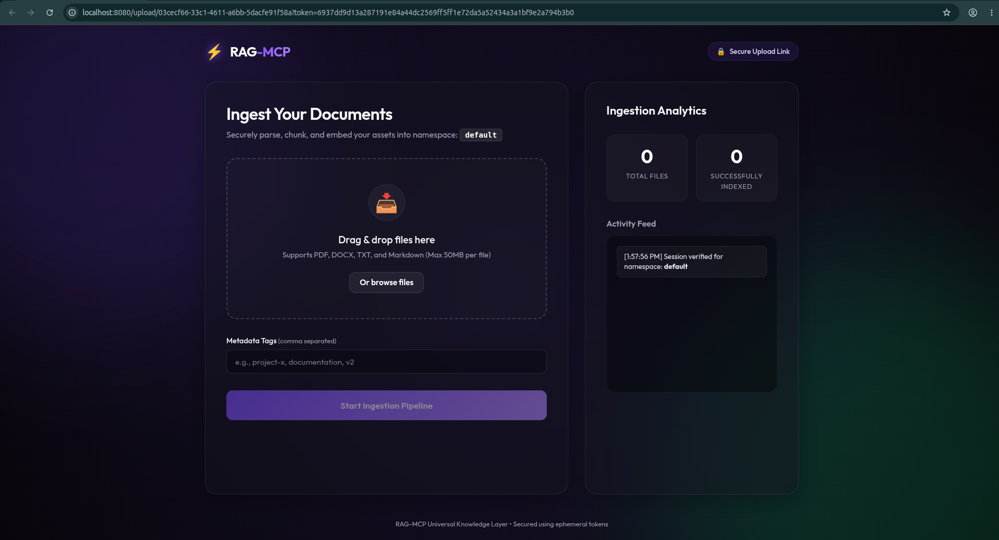

# ⚡ RAG-MCP

Persistent memory for MCP clients, powered by retrieval-augmented generation.

`RAG-MCP` turns documents, notes, web pages, transcripts, and local files into a searchable knowledge layer that MCP-compatible clients can ingest, retrieve, and manage over time. It is designed for assistants that need memory beyond a single chat session.

---

## Overview

`RAG-MCP` is an MCP server that provides a practical memory and retrieval layer for AI clients.

It supports:

- ingestion from raw text
- ingestion from URLs
- ingestion from YouTube transcripts
- ingestion from local files
- semantic retrieval with optional source metadata
- document listing, searching, deletion, and status inspection
- browser-based secure upload sessions for document ingestion
- Prometheus-compatible metrics for runtime visibility

At a high level, the system parses content, chunks it, embeds it, stores vectors in ChromaDB, stores metadata in SQLite, and exposes the entire workflow through MCP tools.

---

## Why this exists

Most MCP clients are excellent at reasoning in the moment, but weak at remembering useful context across sessions.

`RAG-MCP` solves that by giving clients a persistent, queryable memory layer.

Use it when you want to:

- give an assistant long-term memory across conversations
- search documentation, notes, transcripts, or uploaded files semantically
- attach citations and source metadata to retrieval results
- keep knowledge isolated by namespace for teams, projects, or environments
- support both direct ingestion and user-friendly browser uploads

---

## Core capabilities

### Ingestion

Store knowledge from:

- **Text** via `ingest_text`
- **Web pages** via `ingest_url`
- **YouTube transcripts** via `ingest_youtube`
- **Local files** via `ingest_file`
- **Browser upload sessions** via `create_upload_session` + upload UI

Supported local file types:

- `.txt`
- `.md`
- `.markdown`
- `.pdf`
- `.docx`
- `.doc`

### Retrieval

Query stored knowledge using:

- **`retrieve`** for compact semantic matches
- **`retrieve_with_sources`** for source-aware responses with document and chunk metadata

### Document management

Manage the knowledge base with:

- `list_documents`
- `search_documents`
- `delete_document`
- `get_ingestion_status`
- `check_upload_status`

### Runtime features

- Streamable HTTP MCP transport at `/mcp`
- SSE MCP transport at `/sse` / `/messages`
- Upload UI under `/upload`
- Metrics endpoint at `/metrics`

---

## Architecture-level mental model

Think of `RAG-MCP` as a dedicated memory service for MCP clients:

1. **Ingest content** from text, files, URLs, or YouTube
2. **Parse and normalize** the content into plain text
3. **Chunk** the text into retrievable segments
4. **Embed** the chunks into vector representations
5. **Store vectors** in ChromaDB
6. **Store metadata** in SQLite
7. **Query semantically** and return either compact or citation-rich results

This makes the system practical for assistants that need to remember information across time without relying on chat history alone.

---

## Quick start

### Local development

```bash
python -m venv .venv
. .venv/bin/activate
pip install -e "[dev]"
cp .env.example .env
python -m rag_mcp.main
```

Verify the server:

```bash
curl -i http://127.0.0.1:8080/mcp
curl -i http://127.0.0.1:8080/sse
curl -i http://127.0.0.1:8080/metrics
```

### Optional extras

Install optional parsing extras when needed:

```bash
pip install -e ".[pdf]"
pip install -e ".[docx]"
```

---

## Docker usage

### Run with Docker Compose

```bash
docker compose up --build -d
docker compose ps
```

### Check the running service

```bash
curl -i http://127.0.0.1:8080/metrics
curl -i http://127.0.0.1:8080/mcp
```

### Stop the stack

```bash
docker compose down
```

The Compose setup mounts persistent storage for:

- ChromaDB vectors
- SQLite metadata database

---

## Configuration

Configuration is managed through environment variables and loaded by [`Settings`](src/rag_mcp/config.py:8).

Start by copying the sample file:

```bash
cp .env.example .env
```

### Common settings

```bash
RAG_MCP_CHROMA_PATH=/data/chroma
RAG_MCP_METADATA_DB_PATH=/data/metadata.db
RAG_MCP_LOG_LEVEL=INFO
RAG_MCP_EMBEDDING_MODEL=all-MiniLM-L6-v2
RAG_MCP_METRICS_ENABLED=true
RAG_MCP_METRICS_PATH=/metrics
RAG_MCP_METRICS_REQUIRE_AUTH=false
RAG_MCP_UPLOAD_SESSION_SECRET=change-me-in-production
```

### Important notes

- `RAG_MCP_UPLOAD_SESSION_SECRET` should always be set explicitly in real deployments.
- If metrics auth is enabled, configure the metrics token as well.
- Chroma and SQLite paths should point to persistent storage in containerized environments.

---

## Upload Documents (UI)

`RAG-MCP` includes a browser-based upload flow for cases where direct local file ingestion is not convenient.

The flow is:

1. Call `create_upload_session`
2. Open the returned secure upload URL in a browser
3. Upload supported files
4. Poll `check_upload_status` if needed



This is especially useful when:

- the MCP client cannot directly access a file path
- the user wants a friendlier document upload flow
- files need to be uploaded from another machine or browser session

### Upload behavior

- invalid or expired session token returns an error
- unsupported files are rejected during parsing
- upload limits are enforced for file count and size
- indexed files are written into the target namespace

---

## MCP tool usage patterns

### 1. Ingest text directly

```json
{
  "name": "ingest_text",
  "arguments": {
    "title": "Team Notes",
    "namespace": "default",
    "text": "Release checklist: create tag, run tests, publish image"
  }
}
```

### 2. Ingest a web page

```json
{
  "name": "ingest_url",
  "arguments": {
    "url": "https://example.com/docs",
    "namespace": "docs"
  }
}
```

### 3. Retrieve compact results

```json
{
  "name": "retrieve",
  "arguments": {
    "query": "How does release publishing work?",
    "namespace": "default",
    "top_k": 5
  }
}
```

### 4. Retrieve with sources

```json
{
  "name": "retrieve_with_sources",
  "arguments": {
    "query": "What are the deployment steps?",
    "namespace": "docs",
    "top_k": 5
  }
}
```

### 5. List stored documents

```json
{
  "name": "list_documents",
  "arguments": {
    "namespace": "docs",
    "limit": 20
  }
}
```

### 6. Create an upload session

```json
{
  "name": "create_upload_session",
  "arguments": {
    "namespace": "project-x"
  }
}
```

### Recommended usage pattern

A common lifecycle looks like this:

1. ingest into a namespace
2. retrieve against the same namespace
3. inspect with `list_documents`
4. delete or re-ingest as documents change

---

## Observability / metrics

The service exposes Prometheus-compatible metrics at `/metrics`.

Current instrumentation includes request-level visibility such as:

- total HTTP requests
- request latency histogram
- in-flight requests
- exception counters
- default Python/process metrics from the Prometheus client runtime

Example:

```bash
curl -i http://127.0.0.1:8080/metrics
```

This makes it straightforward to plug `RAG-MCP` into:

- Prometheus
- Grafana
- container monitoring dashboards
- local ops/debugging workflows

---

## Security notes

`RAG-MCP` includes practical safeguards for production-style deployments:

- SSRF protection for URL ingestion
- signed upload session tokens with expiry
- upload file count and size limits
- optional metrics authentication and CIDR controls
- request rate limiting for sensitive paths like upload and metrics

Operational recommendations:

- set a strong `RAG_MCP_UPLOAD_SESSION_SECRET`
- keep metrics private or authenticated in shared environments
- use persistent storage for `/data`
- run behind a reverse proxy when exposing publicly

---

## Troubleshooting

### Upload UI says static files are missing

If the upload page does not render correctly, rebuild and restart after updating the image:

```bash
docker compose build
docker compose up -d --force-recreate
```

### `/metrics` returns `503`

If metrics auth is enabled without the required token configuration, the endpoint can fail closed. Check your `.env` values.

### `/mcp` returns a redirect

That is expected. The server supports transport-specific behavior and may redirect to the canonical mounted route.

### URL ingestion fails

Private IPs, loopback targets, metadata endpoints, and blocked schemes are intentionally rejected by SSRF validation.

### Retrieval returns empty results

Check these in order:

1. confirm ingestion completed successfully
2. confirm you are querying the correct namespace
3. broaden the query wording
4. increase `top_k`
5. verify the document exists with `list_documents`

---

## Repository structure

Useful entry points:

- [`README.md`](README.md)
- [`docs/guide/system-architecture.md`](docs/guide/system-architecture.md)
- [`docs/guide/quick-setup.md`](docs/guide/quick-setup.md)
- [`docs/guide/how-to-guide.md`](docs/guide/how-to-guide.md)
- [`src/rag_mcp/config.py`](src/rag_mcp/config.py)
- [`src/rag_mcp/main.py`](src/rag_mcp/main.py)
- [`docker-compose.yml`](docker-compose.yml)
- [`Dockerfile`](Dockerfile)

---

## Contributing

Contributions are welcome.

A solid contribution workflow is:

```bash
python -m venv .venv
. .venv/bin/activate
pip install -e "[dev]"
pytest
```

Before opening a PR:

- keep changes focused
- verify the local server still starts
- run tests
- update docs when behavior changes

---

## License

MIT — see [`LICENSE`](LICENSE).
